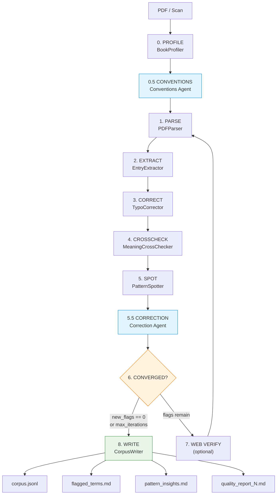
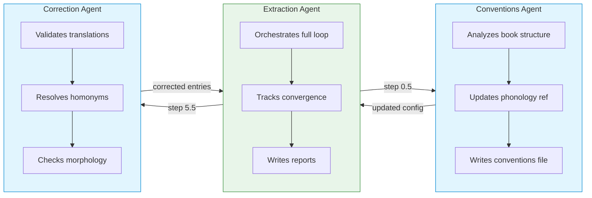
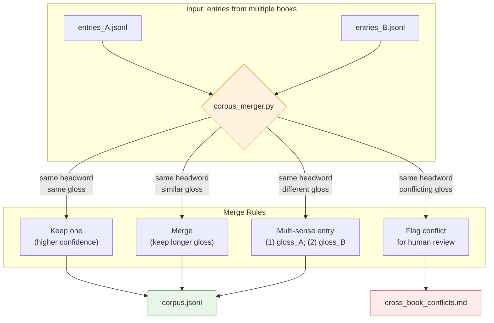

# Nusantara Corpus PDF Extractor

AI-agent **skills and sub-agents** that extract structured parallel-corpus
entries from local/low-resource-language dictionary PDFs (scanned or digital)
into a quality-checked JSONL corpus. Language-agnostic by design; Bahasa
Indonesia is the default pivot language.

This repo ships two ways:

- **An agent skill** (`SKILL.md`) + **agent specs** (`agents/`) that you
  install into your AI coding harness (opencode, Claude Code, etc.) with a
  single `npx skills add` command.
- **A Python package** (`nusantara-corpus-extractor`) on PyPI that provides
  the extraction pipeline (`scripts/`) as an installable CLI.

## What's in the box

| Kind | Location | Purpose |
|------|----------|---------|
| **Skill** | `SKILL.md` | The umbrella extraction skill: full pipeline loop, language setup, quality loop |
| **Skill** | `.opencode/skills/conventions-management/` | Guides the conventions agent: pattern detection, phonology updates |
| **Skill** | `.opencode/skills/linguistic-correction/` | Guides the correction agent: translation validation, homonym resolution |
| **Agent** | `agents/extraction-agent.md` | Orchestrates the full extraction loop |
| **Agent** | `agents/conventions-agent.md` | Learns book structure, updates phonology ref |
| **Agent** | `agents/correction-agent.md` | Validates meaning, resolves ambiguity |
| **Pipeline** | `scripts/*.py` | The Python extraction/quality-loop engine |

## Installing the skill on your harness

The repo ships as a single agent skill — `nusantara-corpus-pdf-extractor`
(the root `SKILL.md` with YAML frontmatter) — and installs with the
[open agent skills CLI](https://github.com/vercel-labs/skills):

```bash
# List what's available
npx skills add masdevid/nusantara-corpus-extractor --list

# Install the skill into your harness (opencode, Claude Code, etc.)
npx skills add masdevid/nusantara-corpus-extractor

# Or target a specific harness / skill
npx skills add masdevid/nusantara-corpus-extractor -a opencode -a claude-code
npx skills add masdevid/nusantara-corpus-extractor --skill nusantara-corpus-pdf-extractor
```

The agent specs (`agents/*.md`) are plain Markdown — copy them into your
harness's agent directory (e.g. `agents/` or `.opencode/agents/` for
subagents).

> **Note:** The skill references the Python pipeline in `scripts/`. Install
> the Python package (below) or keep this repo checked out so the skill's
> commands can find `scripts/`.

## Installing the Python pipeline

The extraction engine is published to PyPI:

```bash
pip install nusantara-corpus-extractor
```

This installs the `nusantara-corpus-extractor` CLI (extract / merge) plus all
pipeline modules. For scanned PDFs you'll also need Tesseract OCR:

```bash
brew install tesseract
```

### Verify the install

```bash
# Python pipeline
nusantara-corpus-extractor --help

# Skills (after npx skills add)
npx skills list
```

## Quick Start

Extraction and merging are **agent-driven**: install the skill, hand the agent
a dictionary PDF, and it runs the full loop (profile → extract → correct →
cross-check → spot → write) using the pipeline below. The commands shown here
are what the agent executes under the hood — you don't normally type them by
hand.

### Prerequisites

```bash
# Install the pipeline (see "Installing the Python pipeline" above)
pip install nusantara-corpus-extractor

# Tesseract OCR (for scanned PDFs)
brew install tesseract
```

### First Extraction

Give the agent a dictionary PDF (or a folder of split PDFs). It will:

1. Set up the language — copy `references/phonology_template.md` to
   `references/<lang>_phonology.md` and fill in orthography rules and OCR
   confusion pairs.
2. Run the extraction loop for a single book:
   ```bash
   nusantara-corpus-extractor extract \
       --pdf "dictionaries/Set-Kamus-Sentani-Indonesia-Inggris-2.pdf" \
       --book-id set \
       --lang-code shj --lang-name Sentani --lang-family "Trans-New Guinea" \
       --phonology references/sentani_phonology.md
   ```
3. Review the output and resolve flags:
   ```bash
   cat out/shj/books/set/entries.jsonl
   cat out/shj/books/set/book_profile.md
   cat out/shj/books/set/flagged_terms.md
   ```

### Merge Multiple Books

After the agent extracts multiple dictionaries for the same language, it
merges them into a single corpus:

```bash
nusantara-corpus-extractor extract --pdf "Kamus Bahasa Sentani.pdf" --book-id kamus ...
nusantara-corpus-extractor merge --lang-code shj

# Check merged corpus
cat out/shj/corpus_shj.jsonl
cat out/shj/cross_book_conflicts.md
```

## Architecture

The pipeline runs a **loop**, not a single pass — it iterates until
convergence (zero new flags) or a maximum iteration count is hit.

### Pipeline Overview



### The Loop

```
0.  PROFILE       classify book kind, detect zones, suggest settings
0.5 CONVENTIONS   analyze entry layout, update phonology ref (sub-agent)
1.  PARSE         extract text from digital/OCR pages
2.  EXTRACT       parse raw text into DictionaryEntry objects
3.  CORRECT       fix OCR confusions, validate orthography
4.  CROSSCHECK    cross-check glosses against corpus + pivot
5.  SPOT          spot systematic issues across flags
5.5 CORRECTION    validate translations, resolve homonyms (sub-agent)
6.  REPORT        track convergence, write quality report
7.  WEB VERIFY    (optional) search for genuinely ambiguous flags
8.  WRITE         output JSONL corpus + markdown reports
```

### Three Agents



| Agent | Role | Runs |
|-------|------|------|
| **Extraction Agent** | Orchestrator — runs the full loop | Every pass |
| **Conventions Agent** | Memory — learns book structure, updates config | After profiling (step 0.5) |
| **Correction Agent** | Linguist — validates meaning, resolves ambiguity | After crosscheck (step 5.5) |

### Detailed Diagrams

> **Note:** The Mermaid diagrams below render when viewed directly on GitHub.
> Click each link to see the full diagram.

- [Pipeline Workflow](docs/diagrams/pipeline.md) — full extraction loop with
  step-by-step script references
- [Multi-Book Workflow](docs/diagrams/multi-book.md) — extracting multiple
  dictionaries, merging, conventions accumulation
- [Agent System](docs/diagrams/agents.md) — how the three agents interact,
  data sharing between agents
- [Data Flow](docs/diagrams/data-flow.md) — input/output file flow, model
  relationships (class diagram), output directory structure

## Configuration

### Language Setup

Each language needs:
1. A `Language` config (code, name, family, pivot_code, pivot_name)
2. A phonology reference file (`references/<lang>_phonology.md`)

```python
from models import Language

sentani = Language(
    code="shj",
    name="Sentani",
    family="Trans-New Guinea",
    pivot_code="ind",           # tesseract lang code for gloss language
    pivot_name="Bahasa Indonesia",
)
```

### Phonology Reference

Copy the template and fill in orthography rules:

```bash
cp references/phonology_template.md references/sentani_phonology.md
```

Key sections:
- **Entry splitting** — regex pattern to cut entries in the text layer
- **Entry pattern** — regex to match a valid headword + gloss
- **Valid characters** — character set for headwords
- **OCR confusion pairs** — known OCR errors for this language
- **Morphology rules** — reduplication, affixes, verb forms

### Pivot Language

Bahasa Indonesia is the default pivot. Override with:

```bash
--pivot-code eng --pivot-name "English"
```

## Multi-Book Workflow

When extracting multiple dictionaries for the same language:

### Directory Structure

```
out/
  shj/                                    # Language level
    sentani_phonology.md                   # Shared orthography reference
    conventions_shj.md                     # Cumulative conventions
    corpus_shj.jsonl                       # Merged corpus from all books
    cross_book_conflicts.md                # Conflicting headwords
    books/
      set/                                # Book: "Set Kamus Sentani"
        entries.jsonl
        book_profile.md
        flagged_terms.md
        conventions_set.md
      sentani_kamus/                       # Book: "Kamus Bahasa Sentani"
        entries.jsonl
        book_profile.md
        conventions_sentani_kamus.md
```

### Step-by-Step

```bash
# 1. Extract each book with --book-id
nusantara-corpus-extractor extract \
    --pdf "dictionaries/Set-Kamus-Sentani.pdf" \
    --book-id set \
    --lang-code shj --lang-name Sentani \
    --phonology references/sentani_phonology.md

nusantara-corpus-extractor extract \
    --pdf "dictionaries/Kamus Bahasa Sentani.pdf" \
    --book-id kamus \
    --lang-code shj --lang-name Sentani \
    --phonology references/sentani_phonology.md

# 2. Merge into single language corpus
nusantara-corpus-extractor merge --lang-code shj

# 3. Resolve cross-book conflicts (if any)
# Edit out/shj/cross_book_conflicts.md, then re-run merge
```

### Merge Rules



| Scenario | Action |
|----------|--------|
| Same headword, same gloss | Keep one (higher confidence wins) |
| Same headword, similar gloss (>80% overlap) | Merge, keep longer gloss |
| Same headword, different gloss | Merge into multi-sense entry |
| Same headword, conflicting glosses | Flag in `cross_book_conflicts.md` |

### Conventions System

**Per-book** (`books/<book_id>/conventions_<book_id>.md`):
- Snapshot of what THIS book looks like
- Read-only after creation (preserves original format)

**Cumulative** (`out/<lang>/conventions_<lang>.md`):
- Patterns observed across ALL books for this language
- Updated after each book extraction
- Informs the conventions agent when extracting a new book

## Multi-Language Projects

### Directory Structure

```
out/
  shj/                  # Sentani
    corpus_shj.jsonl
    books/
      set/
      kamus/
  bhw/                  # Biak
    corpus_bhw.jsonl
    books/
      kamus_biak/
  lni/                  # Lani
    corpus_lni.jsonl
    books/
      kamus_lani_wone/
      kamus_lengkap_lani/
```

### Cross-Language Considerations

- Each language has its own phonology reference, conventions, and corpus
- The phonology reference is per-language (different orthography rules)
- The pivot language is configurable per language (Indonesian, English, etc.)
- There is no cross-language merging — each language produces an independent corpus

## Output Format

### JSONL Corpus

Each line is a dictionary entry:

```json
{
  "id": "a1b2c3d4",
  "headword": "bo",
  "pos": "n",
  "gloss_pivot": "(1) pohon; (2) kayu",
  "examples": ["bo fau ...", "bo siro ..."],
  "page_ref": 42,
  "confidence": 0.95,
  "source_language": "shj",
  "source_book": "set",
  "source_page": 42
}
```

### Report Files

| File | Content |
|------|---------|
| `book_profile.md` | Book kind, page zones, conventions detected |
| `flagged_terms.md` | Open/resolved flags with web evidence |
| `pattern_insights.md` | Systematic issues across flags |
| `quality_report_N.md` | Per-pass stats (entries in/out, flags, convergence) |
| `cross_book_conflicts.md` | Conflicting headwords across books |

## Reference

### Scripts

| Script | Purpose |
|--------|---------|
| `scripts/models.py` | Domain model (Language, DictionaryEntry, FlaggedTerm, etc.) |
| `scripts/pdf_parser.py` | PDF parsing, digital/OCR page detection |
| `scripts/book_profiler.py` | Book classification, zone splitting |
| `scripts/conventions_extractor.py` | Entry layout analysis, pattern detection |
| `scripts/morphology_rules.py` | Reduplication, affix detection, root finding |
| `scripts/translation_checker.py` | Gloss validation, example checking |
| `scripts/homonym_resolver.py` | Homonym/variant classification |
| `scripts/entry_extractor.py` | Raw text → DictionaryEntry objects |
| `scripts/typo_corrector.py` | OCR confusion fixing |
| `scripts/meaning_crosscheck.py` | Gloss cross-checking |
| `scripts/pattern_spotter.py` | Systematic issue detection |
| `scripts/web_verification.py` | Web search queue management |
| `scripts/quality_loop.py` | Loop orchestrator, convergence logic |
| `scripts/corpus_writer.py` | JSONL + markdown output |
| `scripts/corpus_merger.py` | Multi-book corpus merging |
| `scripts/cli.py` | CLI entry point (extract/merge) |

### Agent Specifications

| Agent | File | Purpose |
|-------|------|---------|
| Extraction Agent | `agents/extraction-agent.md` | Full loop orchestration |
| Conventions Agent | `agents/conventions-agent.md` | Book structure analysis |
| Correction Agent | `agents/correction-agent.md` | Linguistic validation |

### Skills

| Skill | File | Purpose |
|-------|------|---------|
| Corpus Extractor | `SKILL.md` | Umbrella extraction skill: pipeline loop, language setup, quality loop |
| Conventions Management | `.opencode/skills/conventions-management/SKILL.md` | Pattern detection, conventions workflow |
| Linguistic Correction | `.opencode/skills/linguistic-correction/SKILL.md` | Translation validation, homonym resolution |

## Publishing a release

The Python package is published to PyPI automatically by the
`.github/workflows/publish.yml` workflow whenever you push a `v*` tag (or
publish a GitHub Release). It builds the sdist + wheel, runs `twine check`,
then uploads using the `PYPI_API_TOKEN` repository secret.

**Only the repo owner can publish.** The workflow is gated so it runs only
when triggered by the owner (`github.actor == github.repository_owner`);
collaborators pushing a tag or publishing a release will have the publish
job skipped.

```bash
# Bump the version in pyproject.toml, then tag and push (as the owner)
git tag v0.2.0
git push origin v0.2.0
```

The workflow uploads `dist/*` to PyPI; the `nusantara-corpus-extractor`
package becomes available for `pip install` shortly after.

## Extending

### Adding a New Language

1. Create a `Language` instance:
   ```python
   Language(code="xyz", name="XYZ", family="Austronesian",
            pivot_code="ind", pivot_name="Bahasa Indonesia")
   ```
2. Copy and fill in `references/phonology_template.md` → `references/<lang>_phonology.md`
3. Run extraction with `--lang-code xyz`

### Adding a New Dictionary

1. Place the PDF in `dictionaries/`
2. Run extraction with `--book-id <descriptive_id>`
3. Merge into the language corpus

### Customizing Morphology Rules

Edit the conventions file or phonology reference to add language-specific
affix patterns, reduplication rules, or verb conjugation patterns.

### Contributing

See `docs/diagrams/` for architecture diagrams, `AGENTS.md` for agent guidelines.
