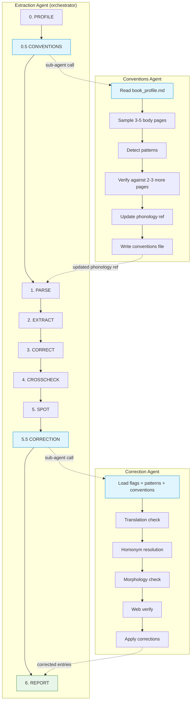
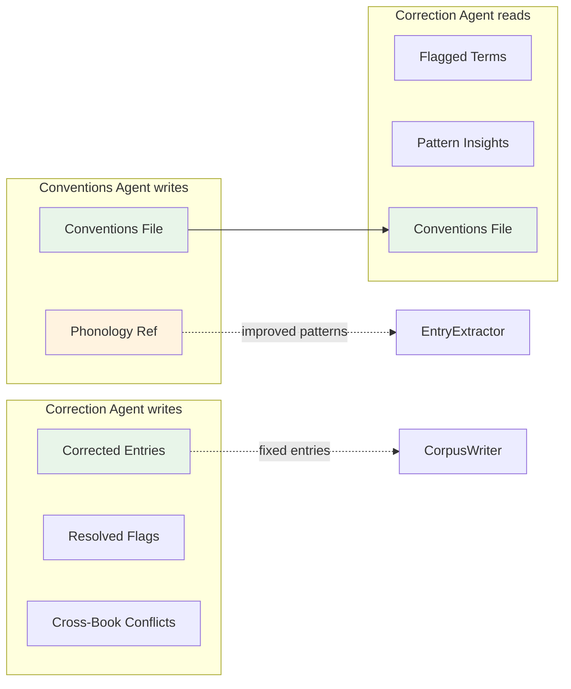

# Agent System

Three agents working together in the extraction pipeline.

## Agent Responsibilities

### Extraction Agent
- **Role:** Orchestrator — runs the full loop, tracks convergence
- **Runs:** Every pass (steps 0-8)
- **Owns:** Quality loop, pass counting, convergence logic

### Conventions Agent
- **Role:** Memory — learns book structure, updates config
- **Runs:** After profiling (step 0.5), on first extraction of a new book
- **Owns:** Phonology ref updates, conventions file, morphology rules
- **Persists:** Per-book conventions snapshot + cumulative language conventions

### Correction Agent
- **Role:** Linguist — validates meaning, resolves ambiguity
- **Runs:** After crosscheck/pattern-spot (step 5.5), when flags remain
- **Owns:** Translation accuracy, homonym resolution, morphology fixes
- **Persists:** Corrected entries, resolved flags, cross-book conflicts

## Data Sharing

