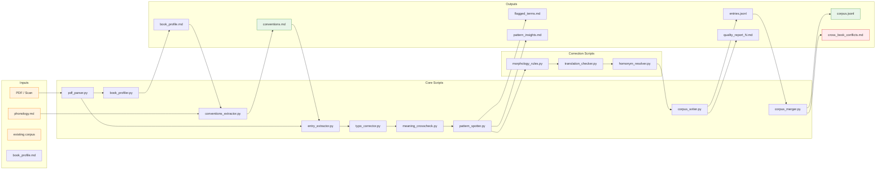
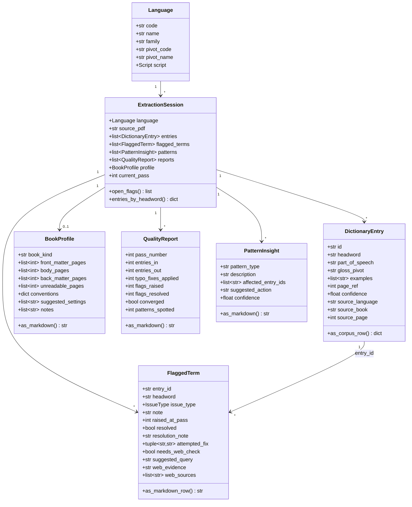
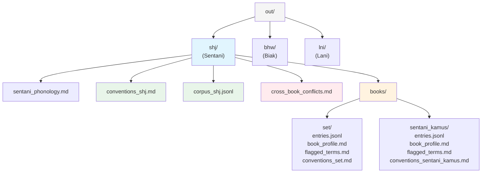

# Data Flow

Inputs → Scripts → Outputs, and model relationships.

## Script Dependencies

```mermaid
flowchart LR
    subgraph "Inputs"
        PDF["PDF / Scan"]
        PHON["phonology.md"]
        EXIST["existing corpus"]
        PROF_IN["book_profile.md"]
    end

    subgraph "Core Scripts"
        BP["book_profiler.py"]
        CE["conventions_extractor.py"]
        PDFP["pdf_parser.py"]
        EE["entry_extractor.py"]
        TC["typo_corrector.py"]
        MC["meaning_crosscheck.py"]
        PS["pattern_spotter.py"]
        CW["corpus_writer.py"]
        CM["corpus_merger.py"]
    end

    subgraph "Correction Scripts"
        MR["morphology_rules.py"]
        TC2["translation_checker.py"]
        HR["homonym_resolver.py"]
    end

    subgraph "Outputs"
        PROF["book_profile.md"]
        CONV["conventions.md"]
        ENT["entries.jsonl"]
        CORP["corpus.jsonl"]
        FLAG["flagged_terms.md"]
        PAT["pattern_insights.md"]
        REP["quality_report_N.md"]
        CBC["cross_book_conflicts.md"]
    end

    PDF --> PDFP
    PDFP --> BP
    BP --> PROF
    PROF --> CE
    PHON --> CE
    CE --> CONV
    CONV --> EE
    PDFP --> EE
    EE --> TC
    TC --> MC
    MC --> PS
    PS --> MR
    MR --> TC2
    TC2 --> HR
    HR --> CW
    CW --> ENT
    ENT --> CM
    CM --> CORP
    PS --> FLAG
    PS --> PAT
    CW --> REP
    CM --> CBC

    style PDF fill:#fff3e0,stroke:#f57c00
    style PHON fill:#fff3e0,stroke:#f57c00
    style EXIST fill:#fff3e0,stroke:#f57c00
    style CORP fill:#e8f5e9,stroke:#388e3c
    style CONV fill:#e8f5e9,stroke:#388e3c
    style CBC fill:#ffebee,stroke:#d32f2f
```

## Model Relationships

```mermaid
classDiagram
    class Language {
        +str code
        +str name
        +str family
        +str pivot_code
        +str pivot_name
        +Script script
    }

    class DictionaryEntry {
        +str id
        +str headword
        +str part_of_speech
        +str gloss_pivot
        +list~str~ examples
        +int page_ref
        +float confidence
        +str source_language
        +str source_book
        +int source_page
        +as_corpus_row() dict
    }

    class FlaggedTerm {
        +str entry_id
        +str headword
        +IssueType issue_type
        +str note
        +int raised_at_pass
        +bool resolved
        +str resolution_note
        +tuple~str,str~ attempted_fix
        +bool needs_web_check
        +str suggested_query
        +str web_evidence
        +list~str~ web_sources
        +as_markdown_row() str
    }

    class BookProfile {
        +str book_kind
        +list~int~ front_matter_pages
        +list~int~ body_pages
        +list~int~ back_matter_pages
        +list~int~ unreadable_pages
        +dict conventions
        +list~str~ suggested_settings
        +list~str~ notes
        +as_markdown() str
    }

    class ExtractionSession {
        +Language language
        +str source_pdf
        +list~DictionaryEntry~ entries
        +list~FlaggedTerm~ flagged_terms
        +list~PatternInsight~ patterns
        +list~QualityReport~ reports
        +BookProfile profile
        +int current_pass
        +open_flags() list
        +entries_by_headword() dict
    }

    class QualityReport {
        +int pass_number
        +int entries_in
        +int entries_out
        +int typo_fixes_applied
        +int flags_raised
        +int flags_resolved
        +bool converged
        +int patterns_spotted
        +as_markdown() str
    }

    class PatternInsight {
        +str pattern_type
        +str description
        +list~str~ affected_entry_ids
        +str suggested_action
        +float confidence
        +as_markdown() str
    }

    Language "1" --> "*" ExtractionSession
    ExtractionSession "1" --> "*" DictionaryEntry
    ExtractionSession "1" --> "*" FlaggedTerm
    ExtractionSession "1" --> "*" PatternInsight
    ExtractionSession "1" --> "*" QualityReport
    ExtractionSession "1" --> "0..1" BookProfile
    DictionaryEntry "1" --> "*" FlaggedTerm : entry_id
```

## Output Directory Structure

```mermaid
flowchart TD
    OUT["out/"] --> LANG["shj/\n(Sentani)"]
    OUT --> LANG2["bhw/\n(Biak)"]
    OUT --> LANG3["lni/\n(Lani)"]

    LANG --> PHON["sentani_phonology.md"]
    LANG --> CONV_CUM["conventions_shj.md"]
    LANG --> CORP["corpus_shj.jsonl"]
    LANG --> CBC["cross_book_conflicts.md"]
    LANG --> BOOKS["books/"]

    BOOKS --> BK1["set/\nentries.jsonl\nbook_profile.md\nflagged_terms.md\nconventions_set.md"]
    BOOKS --> BK2["sentani_kamus/\nentries.jsonl\nbook_profile.md\nflagged_terms.md\nconventions_sentani_kamus.md"]

    style OUT fill:#f5f5f5
    style LANG fill:#e1f5fe
    style CORP fill:#e8f5e9
    style CONV_CUM fill:#e8f5e9
    style CBC fill:#ffebee
    style BOOKS fill:#fff3e0
```
