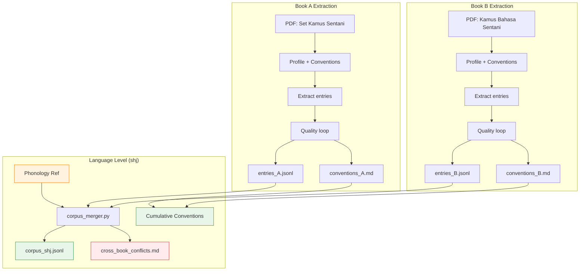
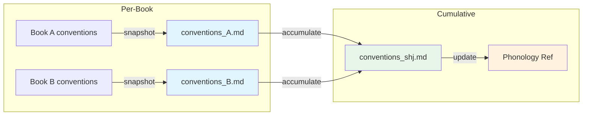

# Multi-Book Workflow

Extracting multiple dictionaries for one language, then merging into a single corpus.



## Merge Rules

| Scenario | Action |
|----------|--------|
| Same headword, same gloss | Keep one (higher confidence wins) |
| Same headword, different gloss | Merge into multi-sense entry with numbered senses |
| Same headword, conflicting glosses | Flag in `cross_book_conflicts.md` for human review |

## Merged Entry Format

```json
{
  "headword": "bo",
  "gloss_pivot": "(1) pohon; (2) kayu; (3) hutan",
  "source_book": ["set", "sentani_kamus"],
  "examples": ["bo fau ...", "bo siro ..."],
  "confidence": 0.92
}
```

## Conventions Flow


