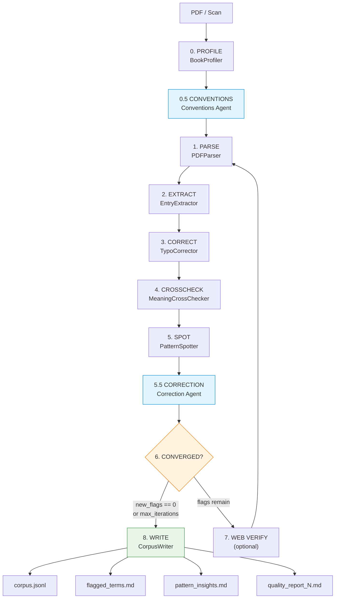

# Pipeline Workflow

Full extraction loop — from PDF to quality-checked corpus.

## Steps

| Step | Script | Purpose |
|------|--------|---------|
| 0 | `book_profiler.py` | Classify book kind, split zones, detect conventions |
| 0.5 | `conventions_extractor.py` | Analyze entry layout, update phonology ref, write conventions |
| 1 | `pdf_parser.py` | Extract text from digital pages, OCR image pages |
| 2 | `entry_extractor.py` | Parse raw text into DictionaryEntry objects |
| 3 | `typo_corrector.py` | Fix OCR confusions, validate orthography |
| 4 | `meaning_crosscheck.py` | Cross-check glosses against corpus + pivot |
| 5 | `pattern_spotter.py` | Spot systematic issues across flags |
| 5.5 | `translation_checker.py`, `homonym_resolver.py`, `morphology_rules.py` | Validate translations, resolve homonyms, check morphology |
| 6 | `quality_loop.py` | Track convergence, write reports |
| 7 | (agent-driven) | Web search for genuinely ambiguous flags |
| 8 | `corpus_writer.py` | Write JSONL corpus + markdown reports |
